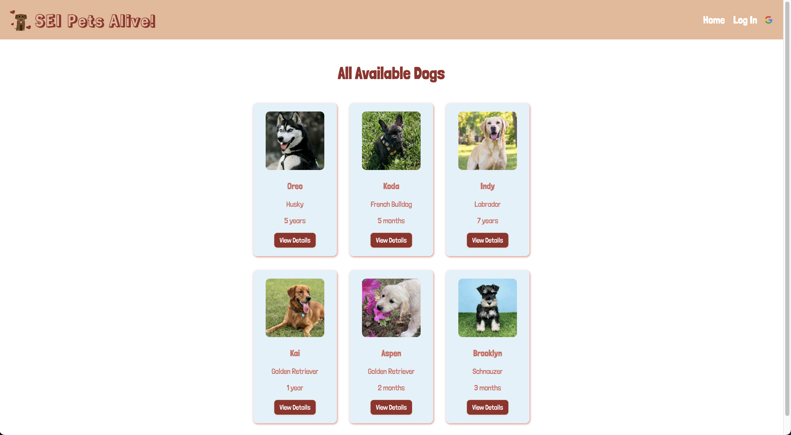
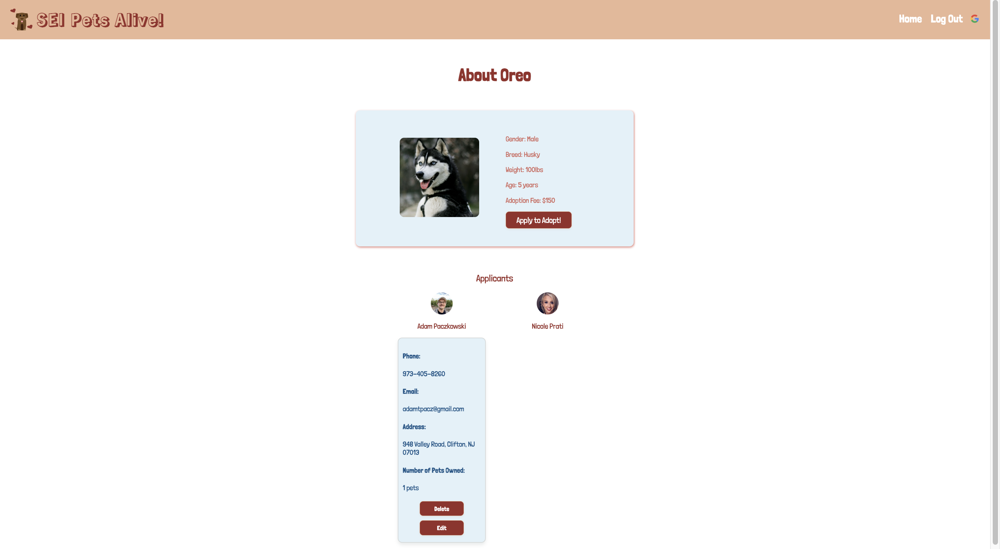
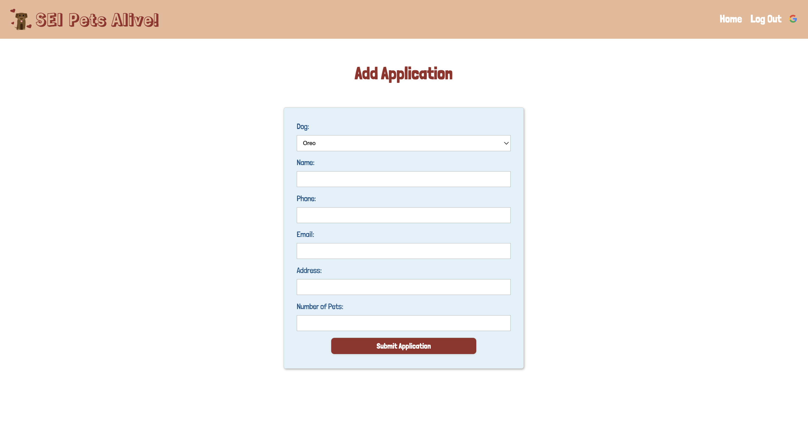
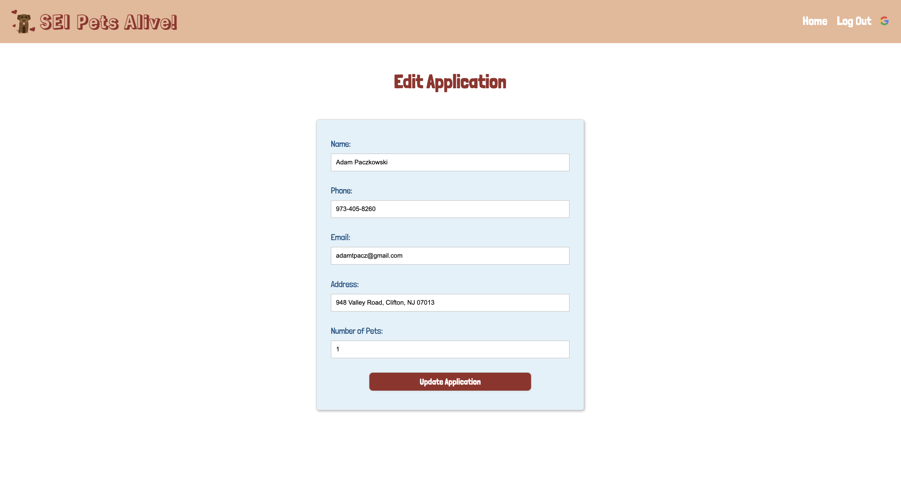

# SEI Pets Alive
## Developed by: 
- Nicole Prati, Adriana Castro and Adam Paczkowski

## Summary: 
- SEI Pets Alive is a dog adoption app. The app is desinged to allow the user to:
    - View all available dogs for adoption
    - Select dogs and see their details
    - Log in and create, edit, and update Applications for the dog(s) they are interested in adopting
    - See if other users have applied to adopt a dog they are interested in on the dogs detail page
    - Users are only able to edit/update and delete thier own applications

## Screenshots:

### Home Page

### Dog Details Page

### New Application Page

### Edit Application Page

## Technologies Used: 
- HTML
- CSS
- JavaScript
- Node
- Mongoose
- MongoDB
- Express.js
- Google OAuth

## Getting Started:
Include a link to the deployed app

## Planning Details:
https://trello.com/b/qbaMEOsp/sei-pets-alive

## Future Enhancements:
### Admin:
- Create an Admin User that has the ability to create, edit, update and delete dogs from the dogs database
- Allow the Admin to see all applications and applicant (user) details on a dog's details page
- Allow the Admin to delete any of the applications on a dog's details page

### User:
- Create a favorite/like button that will alllow the user to favorite/like any of the available dogs.
- The user will be able to then click a link in the navigation bar "Favorites", see all of the dogs they have favortied/liked and select the dogs they want to apply for.